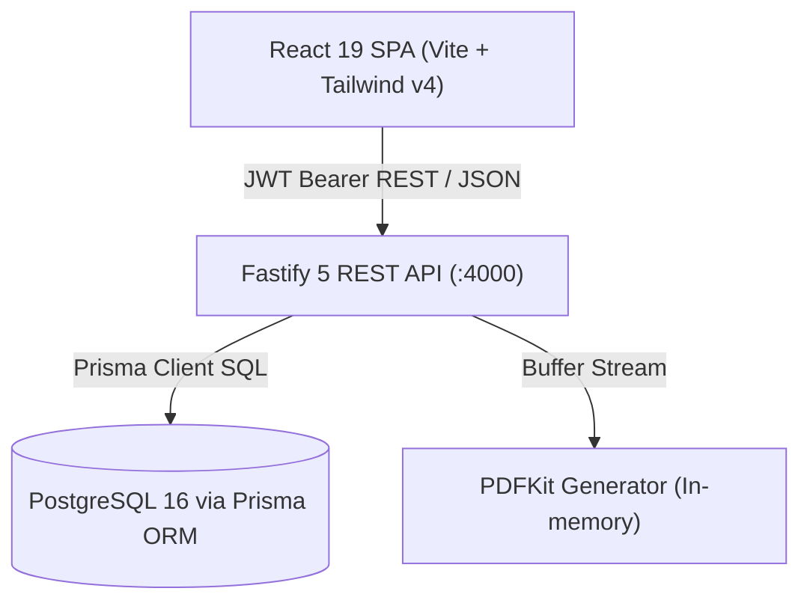

# ARCHITECTURE.md — System Architecture & Design

A dense, skimmable overview of the Ledger CRM architecture, module interactions, and core design decisions.

---

## 1. System Topology

- **Client**: Single-Page Application using React Router v7 and React Query v5.
- **API Server**: Fastify v5 with stateless JWT authentication and dynamic DB tenant validation.
- **Persistence**: Single multi-tenant PostgreSQL database managed via Prisma schema.

---

## 2. Core Modules & Boundaries

### 🔑 Authentication & Tenancy
- **Tenant Isolation Boundary**: Every business entity strictly references `tenantId`.
- **Dynamic Resolution**: JWT payload contains `id` and `tenantId`; Fastify `authenticate` decorator dynamically resolves latest DB `tenantId` & `role` on every request.
- **Role-Based Access Control (RBAC)**: `ADMIN`, `SALES_MANAGER`, `SALES_REP`, `VIEWER` roles enforced per endpoint.

### 🏢 Sales Execution (Leads → Accounts/Contacts → Opps → Deals → Quotes)
- **Canonical 8 Stages**: Both Opportunity and Deal pipelines adhere to a unified, sequential 8-stage lifecycle:
  1. `Lead Qualified` (10% probability)
  2. `Scope Discussion` (25% probability)
  3. `Demo` (40% probability)
  4. `Proposal` (60% probability)
  5. `Quote` (75% probability)
  6. `Negotiation` (90% probability)
  7. `Closed Won` (100% probability, closed/won terminal stage)
  8. `Closed Lost` (0% probability, closed/lost terminal stage)
- **Opportunities vs Deals**:
  - `Opportunity`: Core qualification record containing Account Owner, Account, Contact Person, Opportunity Stage, Deal Stage, Deal Value, Remarks, Assigned To, Created Date, and Close Date.
  - `Deal`: Revenue-contracting phase linking back to parent Opportunity and Account with structured `LineItem` calculations (quantity × unitPrice − discount + tax).
- **Cross-Entity Creation**: Full bidirectional creation flows allow creating any related record (Lead, Account, Contact, Opportunity, Deal) directly from parent detail views with pre-populated relations.
- **Quotes**: Snapshot of deal financials with status state-machine (`DRAFT` → `SENT` → `VIEWED` → `ACCEPTED`/`REJECTED` → `EXPIRED`) and on-the-fly PDF rendering.

### ⚡ Engagement & Collaboration
- **Unified Timeline**: Polymorphic `Activity` (`CALL`, `EMAIL`, `MEETING`, `TASK`) and `Note` logs attached to Accounts, Contacts, Opps, Deals, or Leads.
- **Outreach Sequences**: Automated multi-step cadences (`EMAIL`, `WAIT`, `TASK`, `CALL_REMINDER`) with contact enrollment tracking.
- **Audit Logging**: Immutable `AuditLog` captures `oldValues` vs `newValues` on every entity update.
- **In-App Notifications**: Real-time event notifications (`notify()`) for quote acceptances, lead assignments, and task reminders.

### 📊 Analytics & Reporting
- **Executive Dashboard**: Pre-aggregated KPIs (Weighted Pipeline, Win Rate, Avg Deal Size) + 6-month revenue trends.
- **Action Center**: Live operational signals (Overdue Tasks, Tasks Due Today, Stale Deals at Risk).
- **Forecasting Engine**: Monthly target tracking per sales rep vs closed won & weighted pipeline attainment.
- **Reports**: Pipeline health, sales rep leaderboard, conversion funnel, and win/loss reason analytics.

---

## 3. Data Flow Pathways

### Path A: Lead Conversion Flow
1. User clicks **Convert Lead** on `LeadDetailPage`.
2. Frontend sends `POST /api/v1/leads/:id/convert`.
3. Backend runs a single `prisma.$transaction`:
   - Creates or links `Account`.
   - Creates or links `Contact`.
   - Creates new `Opportunity` in default pipeline.
   - Marks `Lead.status = "CONVERTED"` and records audit log.
4. Returns generated entity IDs; frontend navigates user to newly created Opportunity.

### Path B: Deal Line Items & Quote Generation
1. User adds catalog products to `DealDetailPage`.
2. Backend computes totals and updates `deal.amount`.
3. User clicks **Generate Quote**.
4. Backend creates `Quote` record copying deal items + applies tax/discounts.
5. User requests PDF via `GET /api/v1/quotes/:id/pdf` → `pdfkit` streams A4 buffer directly to client.

---

## 4. Key Architectural Decisions & Rationale

- **Fastify over Express**:
  - *Decision*: Built API server using Fastify 5.
  - *Why*: ~2x higher throughput, built-in schema serialization, native TypeScript typing, clean plugin architecture.

- **Soft vs Hard Tenancy (Row-Level Isolation)**:
  - *Decision*: Single shared PostgreSQL database with `tenantId` column indexing (`@@index([tenantId])`).
  - *Why*: Simpler migrations, lower infrastructure overhead, instant workspace creation without runtime DDL schema provisioning.

- **Stateless JWT with DB-Backed Context Verification**:
  - *Decision*: JWT tokens carry claims, but `authenticate` pre-handler confirms user active status and current `tenantId` from DB.
  - *Why*: Prevents stale workspace access and enables instant role/tenant updates without requiring user re-login.

- **React Query as Server Cache**:
  - *Decision*: Centralized server state management via `@tanstack/react-query` instead of Redux.
  - *Why*: Zero boilerplate for caching, background revalidation, query key invalidation on mutations, and instant optimistic updates.

- **In-Memory PDF Streaming via PDFKit**:
  - *Decision*: Generate quote PDFs directly in Node memory and stream buffer with HTTP headers (`Content-Type: application/pdf`).
  - *Why*: Eliminates local disk I/O bottlenecks and external SaaS PDF dependencies.
